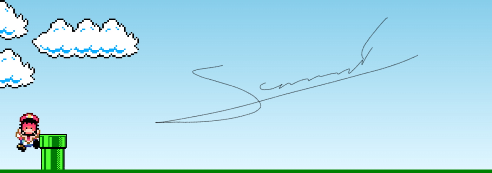

<h1 align="center"> Jogo do Mario</h1>

Projeto recriado através do canal Manual do Dev, para maior entendimento do HTML,CSS e JS. 

  <a href="#-tecnologias">Tecnologias</a>&nbsp;&nbsp;&nbsp;|&nbsp;&nbsp;&nbsp;
  <a href="#-projeto">Projeto</a>&nbsp;&nbsp;&nbsp;|&nbsp;&nbsp;&nbsp;
  <a href="#-layout">Layout</a>&nbsp;&nbsp;&nbsp;|&nbsp;&nbsp;&nbsp;

 

  

## 💡 Tecnologias

Esse projeto foi desenvolvido com as seguintes tecnologias:

- HTML e CSS
- JavaScript

## 💻 Projeto

Jogo do Mario Bros,para diversão e entretenimento para todas as idades!!🎮🏆

## 🔖 Layout

Você pode visualizar o layout do projeto através [DESSE LINK](https://www.youtube.com/watch?v=r9buAwVBDhA).

